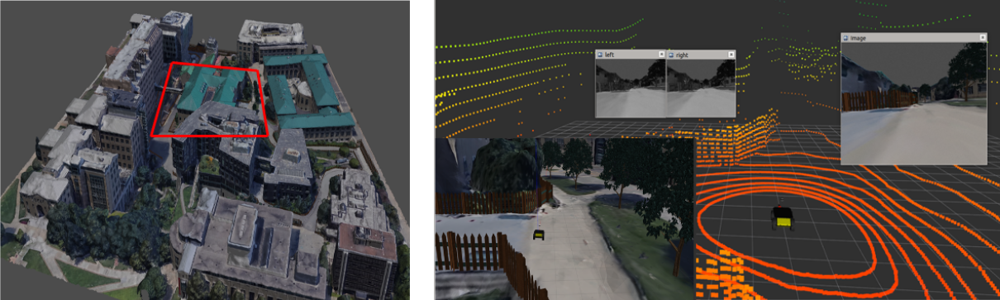
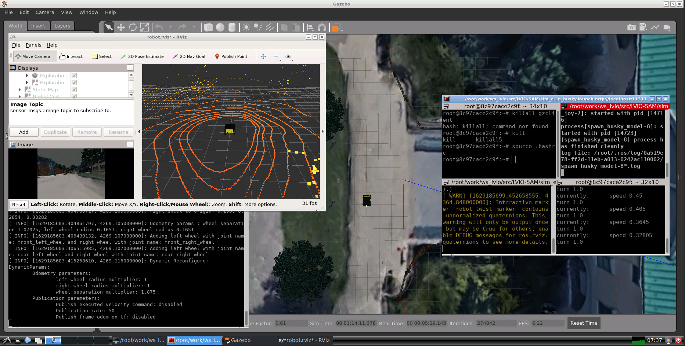
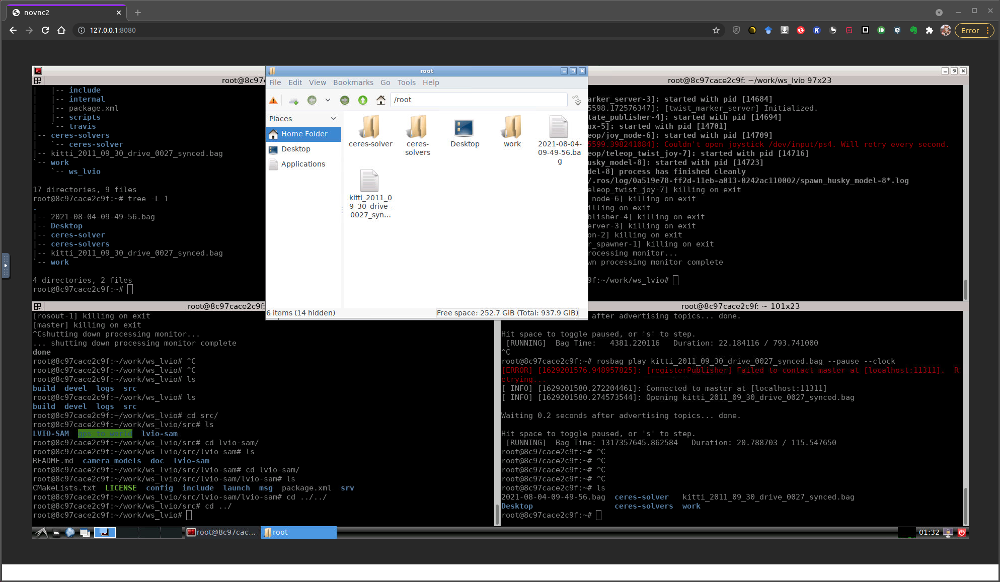
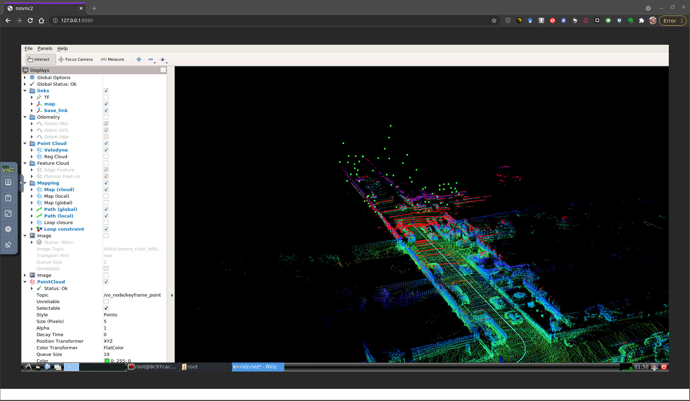

# LVIO-SAM
A multi-sensor fusion odometry, LVIO-SAM, which fuses LiDAR, stereo camera and inertial measurement unit (IMU) via smoothing and mapping.

- The code is still being integrated. we will release it in the feature.


# LVIO-SAM

A multi-sensor fusion odometry, LVIO-SAM, which fuses LiDAR, stereo camera and inertial measurement unit (IMU) via smoothing and mapping.


[![Contributors][contributors-shield]][contributors-url]
[![Forks][forks-shield]][forks-url]
[![Stargazers][stars-shield]][stars-url]
[![Issues][issues-shield]][issues-url]

<!-- PROJECT LOGO -->
<br />
<p align="center">
  <a href="https://github.com/TurtleZhong/LVIO-SAM">
    
  </a>
  <a href="https://github.com/TurtleZhong/LVIO-SAM">
    
  </a>

  <h3 align="center">LVIO-SAM</h3>

  <p align="center">
    A multi-sensor fusion odometry, LVIO-SAM, which fuses LiDAR, stereo camera and inertial measurement unit (IMU) via smoothing and mapping.
    <!-- A basic implementation of <a href="https://arxiv.org/abs/2007.01813">AVP-SLAM: Semantic Visual Mapping and Localization for Autonomous Vehicles in the Parking Lot(IROS 2020)</a> in simulation! -->
    <br />
    <a href="https://www.youtube.com/playlist?list=PLBBuFHQF08z4xjS1IwlQQE0rfKYv4aBD1">Demo Youtube</a>
    ·
    <a href="https://www.bilibili.com/video/BV1Hq4y1S7aL?share_source=copy_web">Demo Bilibili</a>
    ·
    <a href="https://github.com/TurtleZhong/LVIO-SAM/issues">Report Bug</a>
    ·
    <a href="https://github.com/TurtleZhong/LVIO-SAM">Request Feature</a>
  </p>
</p>

<!-- TABLE OF CONTENTS -->
<details open="open">
  <summary>Table of Contents</summary>
  <ol>
    <li>
      <a href="#about-the-project">About The Project</a>
    </li>
    <li><a href="#simulations environment">Simulations environment</a></li>
    <li><a href="#how to run">How to run</a></li>
    <li><a href="#roadmap">Roadmap</a></li>
    <li><a href="#contributing">Contributing</a></li>
    <li><a href="#license">License</a></li>
    <li><a href="#contact">Contact</a></li>
    <li><a href="#acknowledgements">Acknowledgements</a></li>
  </ol>
</details>

<!-- ABOUT THE PROJECT -->
### About The Project
&emsp;&emsp; This project is provide a a multi-sensor fusion odometry, LVIO-SAM, which fuses LiDAR,stereo camera and inertial measurement unit (IMU) via smoothing and mapping.

`!!!Important Notes!!!`


### Simulations environment
&emsp;&emsp; We modify the Gazebo world proposed in [here](https://github.com/jizhang-cmu/ground_based_autonomy_basic) and adding our own sensors to test our proposed method. We use [Husky](https://github.com/husky/husky) as the base robot and we modify the urdf. The robot is equiped with A velodyne VLP 16 lidar, stereo camera(640x480) and an IMU (50Hz).

Download the [CMU campus model](https://drive.google.com/file/d/1GGZsf5QYhy6wGUXvzUn1D8RzcYzM_O4f/view?usp=sharing) to `sim_env/husky_gazebo/mesh/`
```bash
cd YOUR_WORD_PATH/LVIO_SAM/sim_env/husky_gazebo/mesh/
unzip autonomus_exploration_environments.zip
```

I guess c `campus` model it to `~/.gazebo/models/`.
```bash
cd autonomus_exploration_environments/
cp -r campus ~/.gazebo/models/
```

you can launch gazebo and find campu model to check if it is OK.


```bash
git clone https://github.com/TurtleZhong/LVIO-SAM.git

cd YOUR_PATH/LVIO-SAM
catkin build -DCMAKE_BUILD_TYPE=Release
source devel/setup.bash

roslaunch husky_gazebo husky_campus.launch
```

It will take a few minutes to load the world. please start a new terminal and launch the husky and sensor model.

```bash
roslaunch husky_gazebo spawn_husky.launch
```

If everything is OK, you will get this:


<p align="center">
  <a href="">
    
  </a>
</p>

if you want control the robot, you can use the keyboard i,j,k,l etc.

```bash
rosrun teleop_twist_keyboard teleop_twist_keyboard.py
```

### How to run in Docker

&emsp;&emsp; Since our code is still being integrated. we will release it in the feature. But we provide a docker environment for users.  So [Docker]() should be correctly installed.


&emsp;&emsp;Step1. Prepare Datasets

1. KITTI datasets
```bash
wget https://s3.eu-central-1.amazonaws.com/avg-kitti/raw_data/2011_09_30_drive_0027/2011_09_30_drive_0027_sync.zip
wget https://s3.eu-central-1.amazonaws.com/avg-kitti/raw_data/2011_09_30_drive_0027/2011_09_30_drive_0027_extract.zip
wget https://s3.eu-central-1.amazonaws.com/avg-kitti/raw_data/2011_09_30_calib.zip
unzip 2011_09_30_drive_0084_sync.zip
unzip 2011_09_30_drive_0084_extract.zip
unzip 2011_09_30_calib.zip
python kitti2bag.py -t 2011_09_30 -r 0027 raw_synced .
```

That's it. You have a bag that contains your data.
```bash
╰─$ rosbag info kitti_2011_09_30_drive_0027_synced.bag 
path:        kitti_2011_09_30_drive_0027_synced.bag
version:     2.0
duration:    1:55s (115s)
start:       Sep 30 2011 12:40:25.07 (1317357625.07)
end:         Sep 30 2011 12:42:20.41 (1317357740.41)
size:        6.0 GB
messages:    35278
compression: none [4435/4435 chunks]
types:       geometry_msgs/TwistStamped [98d34b0043a2093cf9d9345ab6eef12e]
             sensor_msgs/CameraInfo     [c9a58c1b0b154e0e6da7578cb991d214]
             sensor_msgs/Image          [060021388200f6f0f447d0fcd9c64743]
             sensor_msgs/Imu            [6a62c6daae103f4ff57a132d6f95cec2]
             sensor_msgs/NavSatFix      [2d3a8cd499b9b4a0249fb98fd05cfa48]
             sensor_msgs/PointCloud2    [1158d486dd51d683ce2f1be655c3c181]
topics:      /gps/fix                                 1106 msgs    : sensor_msgs/NavSatFix     
             /gps/vel                                 1106 msgs    : geometry_msgs/TwistStamped
             /imu_correct                            11556 msgs    : sensor_msgs/Imu           
             /imu_raw                                11556 msgs    : sensor_msgs/Imu           
             /kitti/camera_color_left/camera_info     1106 msgs    : sensor_msgs/CameraInfo    
             /kitti/camera_color_left/image_raw       1106 msgs    : sensor_msgs/Image         
             /kitti/camera_color_right/camera_info    1106 msgs    : sensor_msgs/CameraInfo    
             /kitti/camera_color_right/image_raw      1106 msgs    : sensor_msgs/Image         
             /kitti/camera_gray_left/camera_info      1106 msgs    : sensor_msgs/CameraInfo    
             /kitti/camera_gray_left/image_raw        1106 msgs    : sensor_msgs/Image         
             /kitti/camera_gray_right/camera_info     1106 msgs    : sensor_msgs/CameraInfo    
             /kitti/camera_gray_right/image_raw       1106 msgs    : sensor_msgs/Image         
             /points_raw                              1106 msgs    : sensor_msgs/PointCloud2
```


Other source files can be found at [KITTI raw data](http://www.cvlibs.net/datasets/kitti/raw_data.php) page.


2. sim_env datasets

You can record datasets from our simulation environments or download the sample dataset from [BaiduYun Link](https://pan.baidu.com/s/1zrDGtbviyQqyM9vwcQXAUQ), the extract code is `f8to`.


&emsp;&emsp;Get docker images and create your own datasets..
```bash
docker pull xinliangzhong/ubuntu-18.04-novnc-lvio-sam:v1

```

use `docker images` check the image is ok.

```bash
docker run -it --rm -p 8080:80 xinliangzhong/ubuntu-18.04-novnc-lvio-sam:v1

```
then open the Chrome browser and type `http://127.0.0.1:8080/`

open 3 terminal and run

```bash
cd /root
source .bashrc
cd work/ws_lvio/
source devel/setup.bash

roslaunch husky_gazebo husky_campus.launch
```


```bash
roslaunch husky_gazebo husky_campus.launch
```

It will take a few minutes to load the world. please start a new terminal and launch the husky and sensor model.

```bash
roslaunch husky_gazebo spawn_husky.launch
```

&emsp;&emsp; 
```bash
roslaunch husky_viz view_robot.launch
```


If everything is OK, you will get this in your chrome browser:
<p align="center">
  <a href="">
    
  </a>
</p>


### Run LVIO-SAM in docker

Follow the above steps to get the docker image, and open it in  browser:

<p align="center">
  <a href="">
    
  </a>
</p>

```bash
cd /root
source .bashrc
cd work/ws_lvio/
source devel/setup.bash

roslaunch lvio_sam run_kitti_debug_test_vo_between_factor.launch #for kitti dataset.
roslaunch lvio_sam run_kitti_debug_test_vo_between_factor.launch #for sim dataset.
```

we prepare 2 sample bag in the docker, you can use it directly.

```bash
rosbag play kitti_2011_09_30_drive_0027_synced.bag --pause --clock #for kitti dataset.
rosbag play 2021-08-04-09-49-56.bag --pause --clock #for sim dataset.
```

If everything is OK, you will get this in your chrome browser:
<p align="center">
  <a href="">
    
  </a>
</p>


<!-- ROADMAP -->
### Roadmap

* [Gazebo]()
* [simulation environment]()
* [lidar visual inertial odometry]()
* [......]()


<!-- CONTRIBUTING -->
### Contributing

Contributions are what make the open source community such an amazing place to be learn, inspire, and create. Any contributions you make are **greatly appreciated**.

1. Fork the Project
2. Create your Feature Branch (`git checkout -b feature/AmazingFeature`)
3. Commit your Changes (`git commit -m 'Add some AmazingFeature'`)
4. Push to the Branch (`git push origin feature/AmazingFeature`)
5. Open a Pull Request


<!-- LICENSE -->
### License

Distributed under the MIT License.


<!-- CONTACT -->
### Contact

Xinliang Zhong - [@zxl](null) - xinliangzhong@foxmail.com


Project Link: [https://github.com/TurtleZhong/LVIO-SAM](https://github.com/TurtleZhong/LVIO-SAM)


<!-- ACKNOWLEDGEMENTS -->
### Acknowledgements
* [ROS](http://wiki.ros.org/)
* [Gazebo](http://gazebosim.org/)
* [LOAM]()
* [LIO-SAM]()
* [VINS-FUSION]()
* [LVI-SAM]()


<!-- MARKDOWN LINKS & IMAGES -->
<!-- https://www.markdownguide.org/basic-syntax/#reference-style-links -->
[contributors-shield]: https://img.shields.io/github/contributors/TurtleZhong/LVIO-SAM.svg?style=for-the-badge
[contributors-url]: https://github.com/TurtleZhong/LVIO-SAM/graphs/contributors
[forks-shield]: https://img.shields.io/github/forks/TurtleZhong/LVIO-SAM.svg?style=for-the-badge
[forks-url]: https://github.com/TurtleZhong/LVIO-SAM/network/members
[stars-shield]: https://img.shields.io/github/stars/TurtleZhong/LVIO-SAM.svg?style=for-the-badge
[stars-url]: https://github.com/TurtleZhong/LVIO-SAM/stargazers
[issues-shield]: https://img.shields.io/github/issues/TurtleZhong/LVIO-SAM.svg?style=for-the-badge
[issues-url]: https://github.com/TurtleZhong/LVIO-SAM/issues
[license-shield]: https://img.shields.io/github/license/TurtleZhong/LVIO-SAM.svg?style=for-the-badge
[license-url]: https://github.com/TurtleZhong/LVIO-SAM/blob/master/LICENSE.txt
[linkedin-shield]: https://img.shields.io/badge/-LinkedIn-black.svg?style=for-the-badge&logo=linkedin&colorB=555
[linkedin-url]: https://linkedin.com/in/TurtleZhong


